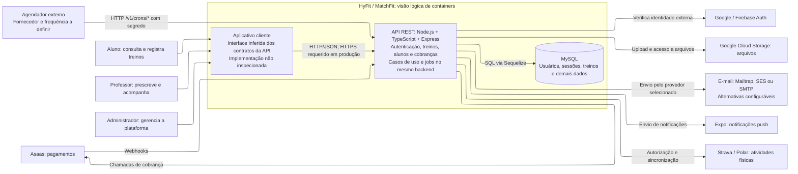
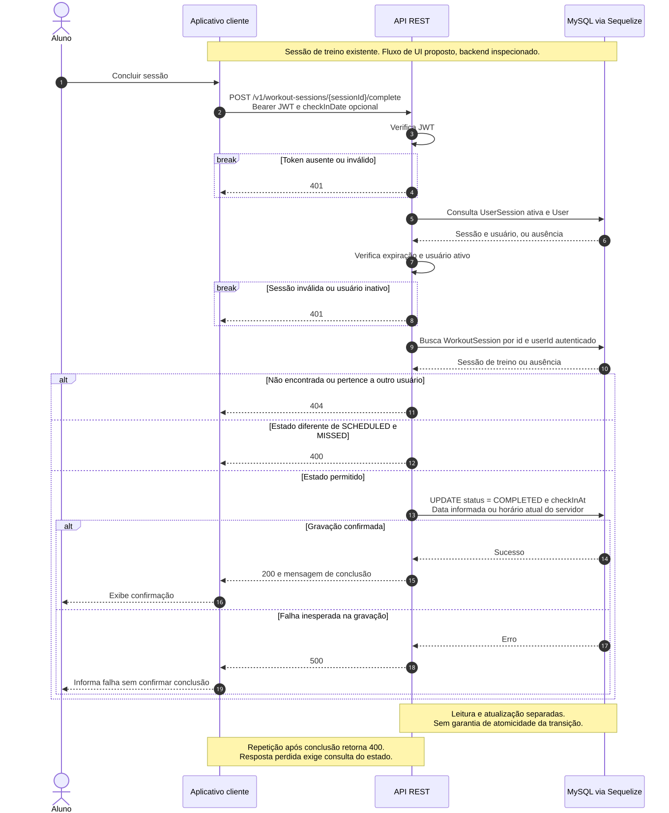
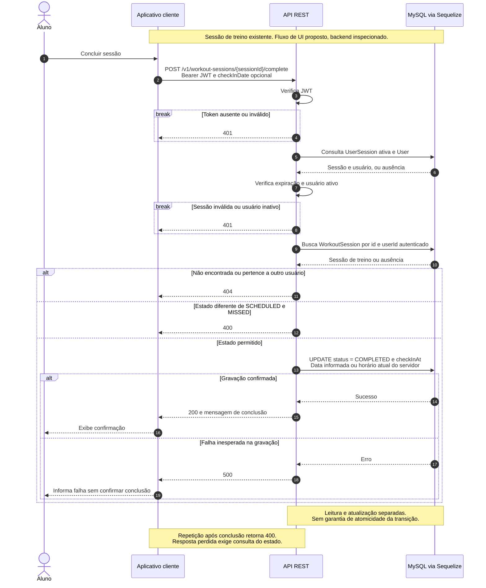

# HyFit / MatchFit — discovery com diagrams as code

Atividade da Unidade III: documentação de um sistema do cotidiano de desenvolvimento, com descrição em linguagem natural, diagrama estrutural e diagrama comportamental em Mermaid, gerados e revisados com auxílio de GenAI.

**Documentação publicada:** [ericojunior/hyfit-diagram](https://github.com/ericojunior/hyfit-diagram), fork público do [repositório indicado para a atividade](https://github.com/EricoJuniordeMorais/hyfit-diagram). A conta disponível nesta sessão não tem permissão de escrita no original; a contribuição está no [pull request #1](https://github.com/EricoJuniordeMorais/hyfit-diagram/pull/1).

**Sistema escolhido:** plataforma de gestão de treinos e acompanhamento de alunos. O repositório da atividade usa o nome HyFit; a implementação de referência se identifica como **MatchFit API**. Esta documentação trata ambos como o mesmo objeto de estudo, sem afirmar que houve uma mudança oficial de marca.

**Natureza do discovery:** análise documental do backend existente, não entrevista com usuários. A referência é o checkout local de `matchfit-api`, commit `73811db9ba1092de8643ce87de9cfa1c4ecdc2cb`, inspecionado em 20/09/2026. O código da aplicação e suas credenciais não fazem parte deste repositório. As fontes consultadas estão registradas em [Evidências](docs/evidencias.md). Comportamentos do frontend e requisitos ainda não confirmados estão identificados como propostas ou lacunas.

## 1. Descrição do sistema

### Problema e escopo

O MatchFit organiza o relacionamento entre professores de atividade física e seus alunos. O professor cadastra e atribui treinos, acompanha sessões e mantém informações dos alunos. O aluno consulta sua programação e registra a conclusão de uma sessão. O backend também contém recursos de grupos, perfil físico, metas, desempenho, planos, assinaturas, faturas, documentos e notificações.

O recorte deste discovery detalha **a arquitetura geral do backend e a jornada de conclusão de uma sessão pelo aluno**. Os demais módulos aparecem apenas para explicar responsabilidades e integrações; não estão integralmente especificados aqui.

Ficam fora do recorte: desenho de telas, prescrição automática por IA, regras clínicas, implementação completa de cobrança, infraestrutura física, dimensionamento e modelo completo de dados. A presença de uma integração no código não comprova que ela esteja habilitada ou operacional em produção.

### Nível da visão, limites e responsabilidades

A visão estrutural é inspirada no **nível 2 do C4, containers**: aplicações e armazenamento, pessoas, sistemas externos e suas relações. Container significa unidade de execução ou armazenamento, não necessariamente Docker. O desenho não apresenta controllers, casos de uso ou cada job como microsserviços. Esses elementos pertencem ao mesmo backend.

| Elemento | Responsabilidade | Limite |
| --- | --- | --- |
| Aluno | Consultar treinos e registrar a execução | Atua sobre sessões vinculadas à sua identidade |
| Professor | Prescrever treinos e acompanhar alunos | As regras completas de vínculo e permissão precisam de especificação própria |
| Administrador | Gerenciar funções da plataforma | Matriz detalhada de permissões fora deste recorte |
| Aplicativo cliente | Apresentar dados e enviar solicitações | Existência inferida dos contratos; código e tecnologia do frontend não inspecionados |
| API REST | Autenticar, autorizar acesso e executar regras de negócio | Express, casos de uso e jobs compõem um backend; não substitui provedores externos |
| MySQL | Persistir usuários, sessões, treinos e outros dados | Acesso mediado pela API com Sequelize |
| Agendador externo | Disparar rotinas em produção | Provedor e periodicidade não confirmados; chama endpoints protegidos de cron |
| Provedores externos | Identidade, arquivos, mensagens, pagamentos e atividades | Disponibilidade e contratos pertencem aos respectivos serviços |

### Integrações identificadas

| Integração | Papel observado | Observação |
| --- | --- | --- |
| Google / Firebase Auth | Verificação de identidade externa | A API também possui autenticação e sessões próprias com JWT |
| Asaas | Operações de pagamento e recebimento de webhooks | Não participa diretamente da conclusão de sessão |
| Google Cloud Storage | Armazenamento de arquivos | Não é o banco relacional |
| Mailtrap, AWS SES ou SMTP | Envio de e-mail | São alternativas selecionadas por configuração, não três envios simultâneos |
| Expo | Notificações push | Nenhuma chamada de push foi identificada no caso de uso de conclusão |
| Strava e Polar | Autorização e sincronização de atividades físicas | Não se presume sincronização em tempo real |
| Agendador externo | Chamadas HTTP a `/v1/crons/*` | Em desenvolvimento, o servidor inicia algumas rotinas no próprio processo |

### Restrições observadas e decisões pendentes

- A stack observada é Node.js, TypeScript, Express, Sequelize e MySQL. O cliente conversa com a API em HTTP/JSON; HTTPS em produção é uma exigência proposta, cujo ponto de terminação não foi inspecionado.
- A autenticação verifica JWT, sessão ativa, expiração e situação do usuário no banco. Não basta validar a assinatura do token.
- A conclusão busca a sessão por `id` **e** `userId` autenticado. Uma sessão alheia é tratada como não encontrada.
- A conclusão aceita estados `SCHEDULED` e `MISSED`, permitindo registro tardio. Não aceita `COMPLETED` nem `CANCELLED`.
- `checkInDate` é opcional: o controller converte a entrada em `Date`; sem ela, o caso de uso usa o horário atual do servidor. Validação de formato, datas futuras, limite para registro tardio e fuso precisam ser definidos.
- A rota de conclusão possui `authMiddleware`, sem um middleware adicional de perfil de aluno ou de acesso por assinatura nessa rota. O desenho não acrescenta essas verificações como se já existissem.
- Não há transação envolvendo leitura e alteração nem atualização condicional por estado nesse caso de uso. Portanto, a documentação não promete proteção contra duas conclusões simultâneas.
- Metas de disponibilidade, latência, capacidade, orçamento, retenção e recuperação ainda não foram levantadas. Não há afirmação de conformidade regulatória nem auditoria de segurança neste trabalho.

## 2. Diagrama estrutural



Fonte editável: [containers.mmd](diagrams/containers.mmd). Os sistemas fora do limite são dependências externas. O aplicativo está dentro do limite lógico do produto, mas sua implementação não foi inspecionada. O diagrama mostra integrações principais e não substitui uma topologia de implantação.

<details>
<summary>Ver código Mermaid</summary>

<!-- diagram:containers:start -->



<!-- diagram:containers:end -->

</details>

## 3. Diagrama comportamental — concluir uma sessão de treino

**Jornada crítica:** o aluno registra que concluiu uma sessão previamente criada. A criação do treino, sua atribuição e o login completo antecedem este fluxo. A sessão de autenticação é verificada novamente em cada solicitação.



Fonte editável: [concluir-sessao.mmd](diagrams/concluir-sessao.mmd). A API e o banco representam comportamento observado no código; mensagens e estados visuais do aplicativo são propostas para orientar a futura interface. Erros inesperados também podem ocorrer nas consultas e ser convertidos pelo tratador global em `500`; o desenho detalha esse ramo na gravação para manter a leitura simples.

<details>
<summary>Ver código Mermaid</summary>

<!-- diagram:concluir-sessao:start -->



<!-- diagram:concluir-sessao:end -->

</details>

### Contrato observado no recorte

```http
POST /v1/workout-sessions/42/complete
Authorization: Bearer <token>
Content-Type: application/json

{}
```

Também há suporte a um corpo como `{"checkInDate":"2026-09-20T18:00:00-03:00"}`. O exemplo demonstra a entrada consumida pelo controller; não constitui um schema de validação já implementado.

Sucesso: `200` com `{"message":"Sessão concluída com sucesso"}`. Os erros de aplicação usam `errorMessage`, `errorCode` e `errorData`.

| Cenário | Comportamento observado / critério para preservar |
| --- | --- |
| Token ausente, inválido ou sessão expirada | `401`; não executar o caso de uso de conclusão |
| Usuário inativo | `401` |
| Sessão inexistente ou pertencente a outro usuário | `404`; não alterar o registro |
| Sessão própria em `SCHEDULED` | Persistir `COMPLETED` e `checkInAt`; retornar `200` |
| Sessão própria em `MISSED` | Permitir conclusão tardia, com o mesmo resultado |
| Sessão em `COMPLETED` ou `CANCELLED` | `400`; uma repetição sequencial não retorna o mesmo sucesso |
| Sem `checkInDate` | Usar horário atual do servidor |
| Falha inesperada no banco | Tratador global responde `500`, quando a conexão permite |
| Resposta perdida após gravação | Estado pode já estar concluído; interface deve consultar antes de afirmar falha definitiva |
| Duas solicitações simultâneas | Resultado não especificado com garantia; requer decisão sobre concorrência |

Esses cenários derivam da leitura do código e orientam futuros testes. **Não são um relatório de testes executados na API.** A operação mantém o estado final de conclusão em uma repetição sequencial, mas não oferece o contrato de repetição segura com a mesma resposta; em concorrência, a data pode ser sobrescrita.

## 4. Uso de GenAI, decisões e ajustes

A GenAI utilizada foi o **Codex**, nesta sessão, para inspecionar o backend, elaborar diagramas Mermaid e revisar a documentação. O [registro de geração](docs/geracao-ia.md) conserva o contexto, os rascunhos efetivamente produzidos e os critérios de revisão. Não foram realizadas entrevistas nem registrada uma aprovação humana individual de cada decisão técnica.

| Aspecto | Rascunho gerado | Decisão / ajuste na revisão | Motivo |
| --- | --- | --- | --- |
| Separação estrutural | Aplicativo, API e banco | Mantida e detalhada com tecnologias, responsabilidades e limite do sistema | Compatível com o backend inspecionado |
| Jornada principal | Aluno solicita conclusão; API grava e confirma | Mantida | Sucesso deve refletir persistência confirmada |
| Abrangência | Somente aluno e professor, sem integrações | Acrescentados administrador, serviços externos e agendador | O rascunho omitia dependências presentes no código |
| Granularidade | API genérica | Mantido um backend, com casos de uso e jobs internos | Não há evidência para transformar módulos em microsserviços |
| Autenticação e propriedade | Ausentes na sequência inicial | Acrescentadas verificação de JWT, sessão/usuário e consulta pelo dono | Um identificador de sessão, sozinho, não autoriza alteração |
| Estados permitidos | Sem distinção de estados | Explicitados `SCHEDULED` e `MISSED`; demais retornam `400` | Preserva o check-in tardio e evita inventar transições |
| Data da conclusão | Não especificada | Documentado `checkInDate` opcional e horário do servidor | Evita assumir que a API sempre atribui a data |
| Falhas e repetição | Apenas sucesso | Incluídos `401`, `404`, `400`, `500`, perda de resposta e lacuna de concorrência | Não prometer atomicidade ou repetição segura ausentes no código |
| Frontend | Aplicativo sem ressalvas | Identificado como interface inferida e fluxo visual proposto | O frontend não foi inspecionado |
| Execução dos jobs | Não representada | Agendador externo em produção; rotinas locais em desenvolvimento | Diferencia responsabilidade lógica de implantação |

**O modelo inferiu corretamente** a separação cliente–API–banco e a jornada de persistir antes de confirmar. **A revisão precisou acrescentar** evidências do domínio, autorização, estados, integrações e caminhos de erro. A principal lição é que um desenho plausível não basta: cada detalhe relevante precisa estar sustentado pelo código, por um requisito aprovado ou por uma indicação explícita de incerteza.

## 5. O que falta para um agente construir sem inventar decisões

| Lacuna | Artefato ou decisão necessária | Responsável pela validação |
| --- | --- | --- |
| Necessidades e vocabulário | Validar jornadas com alunos/professores e confirmar nome do produto | Produto e usuários |
| Contratos HTTP | OpenAPI completo, schemas, erros, paginação e exemplos | Backend e produto |
| Datas | Formato aceito, fuso, datas futuras e janela de conclusão tardia | Produto e backend |
| Concorrência e repetição | Escolher atualização condicional/transação, retorno de repetição e política para timeouts | Backend e produto |
| Autorização | Matriz de perfis, vínculos e acesso por assinatura por endpoint | Produto e backend |
| Dados | Dicionário, relacionamentos, constraints, índices e migrações revisadas | Backend |
| Interface | Telas, acessibilidade, estados de carregamento, erro e resultado incerto | Produto e frontend |
| Integrações | Contratos, ambientes, autenticação de webhooks, retries, deduplicação e limites | Backend e operação |
| Jobs e implantação | Agendador, frequência, exclusão mútua, execução em múltiplas instâncias e segredos | Operação e backend |
| Requisitos não funcionais | Carga, latência, disponibilidade, observabilidade, backup e restauração | Produto e operação |
| Dados pessoais | Finalidade, consentimento quando aplicável, retenção, acesso e exclusão | Responsáveis pelo produto e privacidade |
| Aceite | Testes de autorização, estados, concorrência, datas, contratos e falhas | Desenvolvimento e qualidade |

**Orientação para agentes futuros:** este discovery é contexto arquitetural, não especificação completa. Preserve as regras observadas ao reproduzir o comportamento atual. Quando a tarefa depender de uma lacuna, obtenha uma decisão do responsável e registre-a antes de escolher por conta própria. Atualize requisitos, diagramas e critérios de aceite juntos. Não trate rascunhos históricos como requisitos vigentes nem acrescente filas, microsserviços, notificações na conclusão ou novas regras de assinatura sem uma decisão documentada.

## 6. Versionamento e reprodução

Os arquivos `diagrams/*.mmd` são as fontes oficiais dos desenhos vigentes. O README inclui imagens SVG renderizadas e cópias dos códigos Mermaid, sincronizadas pelo script. Os rascunhos ficam separados em `docs/rascunhos/`.

Com Node.js e npm instalados:

```sh
npm ci
npm run docs:sync
npm run docs:check
npm run docs:render
```

O Mermaid CLI tem versão direta fixada em `11.14.0`; `package-lock.json` registra as dependências. A instalação inicial requer rede e um navegador compatível com Puppeteer, baixado por ele conforme o ambiente. A renderização foi executada com Node.js 25.2.1. Fontes e navegador podem alterar detalhes visuais entre máquinas; não se promete SVG idêntico byte a byte.

Ao editar, altere os `.mmd`, sincronize o README, renderize novamente e versione fontes e SVGs no mesmo commit. `docs:check` detecta divergência entre fontes e blocos Markdown; o CLI verifica se a sintaxe pode ser renderizada. Esses passos não validam as regras de negócio nem substituem testes do sistema.

## 7. Entrega e participação

- [Texto preparado para postagem no fórum](docs/postagem-forum.md).
- [Sugestão ao colega e referência do repositório visitado](docs/sugestao-colega.md).
- [Registro de geração e revisão com GenAI](docs/geracao-ia.md).
- [Evidências consultadas no backend](docs/evidencias.md).
